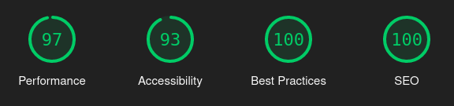

# ahead

## Introduction

Website of an emotional intelligence app with latest technologies and best practices

## Tech Stack

The tech stack for this API includes:

- Next.js
- TypeScript
- Tailwind CSS

### Features

- Responsive design
- Infinite carousel
- Next.js app router
- Live deployment

## Installation

### 1. clone the repository

`git clone https://github.com/bhupeshpr25/ahead`

### 2. install dependencies

`pnpm install` or npm/yarn equivalent

### 3. run the application

`pnpm dev`

## Additional Links

design inspiration - [dribbble](https://dribbble.com/shots/19807069-Ahead-app-redesign-concept)

live deployment - https://ahead-web.vercel.app/
